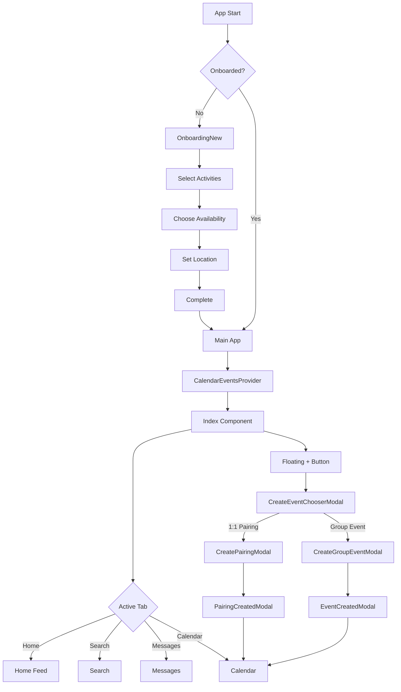

# ConnectSphere - Social Activity Pairing App

A modern social platform for creating and managing one-to-one and group activities. Connect with friends, discover new activities, and organize events seamlessly.

**Lovable Project URL**: https://lovable.dev/projects/461347f8-a9d3-412f-b152-787ba614a672

---

## 📚 Table of Contents
1. [Overview](#-overview)
2. [Technology Stack](#️-technology-stack)
3. [Project Structure](#-project-structure)
4. [Core Features](#-core-features)
5. [Application Flow](#-application-flow)
6. [Design System](#-design-system)
7. [Development Guidelines](#-development-guidelines)
8. [Setup & Deployment](#-setup--deployment)
9. [Important Notes](#-important-notes)

---

## 🚀 Overview

ConnectSphere is a React-based web application that helps users organize social activities, create pairings for one-on-one meetups, and manage group events. The app features an intuitive interface with calendar integration, real-time messaging, and comprehensive event management.

### Key Capabilities
- 🤝 One-to-one activity pairings
- 👥 Group event creation
- 📅 Integrated calendar system
- 💬 Messaging interface
- 🔍 Activity discovery
- 📱 Mobile-responsive design

---

## 🛠️ Technology Stack

### Core Framework
- **React**: 18.3.1 with TypeScript
- **Build Tool**: Vite
- **Routing**: React Router v6

### UI & Styling
- **Tailwind CSS**: Utility-first styling with custom design system
- **Shadcn/ui**: Premium component library built on Radix UI
- **Framer Motion**: Smooth animations and transitions
- **Lucide React**: Beautiful, consistent icon system

### State & Data Management
- **Context API**: Application-wide state (calendar events)
- **TanStack Query**: Server state management
- **React Hook Form**: Form handling and validation

### Utilities
- **date-fns**: Date manipulation
- **react-day-picker**: Calendar UI
- **Sonner**: Toast notifications
- **clsx & tailwind-merge**: Dynamic className handling

---

## 📁 Project Structure

```
├── src/
│   ├── components/
│   │   ├── ui/                         # Shadcn UI components (Button, Dialog, etc.)
│   │   ├── figma/                      # Figma-exported components
│   │   ├── Home.tsx                    # Main home feed with activity discovery
│   │   ├── Search.tsx                  # Search and discovery interface
│   │   ├── Messages.tsx                # Messaging system
│   │   ├── Calendar.tsx                # Calendar view (month/week/day)
│   │   ├── OnboardingNew.tsx           # Multi-step user onboarding
│   │   ├── CreatePairingModal.tsx      # 1:1 pairing creation modal
│   │   ├── CreateGroupEventModal.tsx   # Group event creation modal
│   │   ├── CreateEventChooserModal.tsx # Event type selector
│   │   ├── PairingCreatedModal.tsx     # Success modal for pairings
│   │   ├── EventCreatedModal.tsx       # Success modal for group events
│   │   ├── BottomNavigation.tsx        # Mobile navigation bar
│   │   ├── InviteFloatingAction.tsx    # Floating action button
│   │   └── ...
│   ├── context/
│   │   └── calendar-events-context.tsx # Centralized event state management
│   ├── pages/
│   │   ├── Index.tsx                   # Main app container & routing logic
│   │   ├── HomePage.tsx                # Home page wrapper
│   │   ├── CalendarPage.tsx            # Calendar page wrapper
│   │   ├── MessagesPage.tsx            # Messages page wrapper
│   │   └── NotFound.tsx                # 404 page
│   ├── types/
│   │   └── calendar.ts                 # TypeScript definitions for events
│   ├── hooks/
│   │   ├── use-mobile.ts               # Mobile device detection
│   │   └── use-toast.ts                # Toast notification hook
│   ├── lib/
│   │   └── utils.ts                    # Utility functions (cn, etc.)
│   ├── data/
│   │   └── calendar-events.ts          # Mock event data
│   ├── App.tsx                         # Root app component
│   ├── main.tsx                        # App entry point
│   └── index.css                       # Global styles & CSS variables
├── components/                         # Legacy components (being migrated to src/)
├── tailwind.config.ts                  # Tailwind configuration
├── vite.config.ts                      # Vite build configuration
├── tsconfig.json                       # TypeScript configuration
└── package.json                        # Dependencies and scripts
```

---

## 🎯 Core Features

### 1. **Onboarding Flow** (`OnboardingNew.tsx`)
**Purpose**: First-time user setup and preference collection

**Steps**:
1. Activity selection (sports, hobbies, etc.)
2. Availability time slots (morning, afternoon, evening)
3. Location setup
4. Completion

**Flow**: `OnboardingNew.tsx` → `handleOnboardingComplete()` → Main App

**State**: Currently not persisted (shows on every visit)

---

### 2. **Home Feed** (`Home.tsx`)
**Purpose**: Main dashboard with activity discovery

**Components**:
- Discover Feed (`DiscoverFeed.tsx`) - Activity recommendations
- Nearby Activities (`NearbyActivitiesBlock.tsx`) - Location-based suggestions
- One-to-One Connections (`OneToOneConnections.tsx`) - Pairing management
- Groups (`Groups.tsx`) - Group activity cards

**Navigation**: Bottom Navigation → Home tab (default)

---

### 3. **Event Creation System**

#### **Overall Flow**
```
Floating "+" Button
  ↓
CreateEventChooserModal (Choose event type)
  ↓
  ├─→ 1:1 Pairing → CreatePairingModal → PairingCreatedModal → Calendar
  └─→ Group Event → CreateGroupEventModal → EventCreatedModal → Calendar
```

#### **A. One-to-One Pairings** (`CreatePairingModal.tsx`)
**Purpose**: Create personalized 1:1 activity invitations

**Form Fields**:
- **Title**: Optional custom title
- **Activity**: Max 20 chars, 2 words (with autocomplete)
- **Availability**:
  - Days: Any (default) or specific days (Mon-Sun)
  - Times: Morning, Afternoon, Evening, Night
  - Custom Date/Time: Overrides day/time selections
- **Location**: City/place with Swedish location suggestions
- **Repeat**: Never, Daily, Weekly, Monthly, Yearly
- **Description**: Optional text area
- **Buddy Selection**: Single user (1:1 only)

**Sharing Options** (mutually exclusive):
1. **Copy Link**: Displays copied link below when clicked
2. **QR Code**: Shows QR code display
3. **Share**: Opens platform grid:
   - Row 1: SMS, WhatsApp, Messenger, Telegram
   - Row 2: Email, X (Twitter), More Options (2 cols)
   - Design: Smaller buttons (11h x 11w), rounder, no borders, 4 per row

**Important Behaviors**:
- When one sharing option is selected, others auto-deselect
- "Any" day selection deselects all specific days
- Selecting all specific days (Mon-Sun) reverts to "Any"
- Custom date/time disables day/time slot selections
- Activity suggestions filter as user types

**Data Flow**:
```typescript
handleCreatePairing(pairingData) 
  → Create CalendarEvent object
  → addEvents([newEvent]) 
  → Update context
  → Show PairingCreatedModal
  → Navigate to Calendar tab
```

---

#### **B. Group Events** (`CreateGroupEventModal.tsx`)
**Purpose**: Create multi-person activities

**Form Fields**:
- **Event Name**: Required
- **Activity**: Same as pairing (20 chars, 2 words)
- **Date**: Required (no "Any" option)
- **Time**: Required
- **Location**: Same location suggestions as pairing
- **Max Participants**: Optional number
- **Description**: Optional
- **Event Image**: Upload/URL (not fully implemented)
- **Buddy Selection**: Multiple users allowed

**Data Flow**:
```typescript
handleCreateGroupEvent(eventData)
  → Create CalendarEvent object
  → addEvents([newEvent])
  → Update context
  → Show EventCreatedModal
  → Navigate to Calendar tab
```

---

### 4. **Calendar System** (`Calendar.tsx`)
**Purpose**: View and manage all events

**Features**:
- Month/Week/Day view toggle
- Event cards with color coding:
  - One-to-one: Blue theme
  - Group: Purple theme
- Click event → Event Details Modal
- Event management: Edit, Delete, View Attendees
- Integration with `calendar-events-context`

**State Management**:
```typescript
CalendarEventsProvider (context/calendar-events-context.tsx)
  - events: CalendarEvent[]
  - addEvents(events: CalendarEvent[])
  - updateEvent(id: string, updates: Partial<CalendarEvent>)
  - deleteEvent(id: string)
  - getEventById(id: string): CalendarEvent | undefined
```

---

### 5. **Search & Discovery** (`Search.tsx`)
**Purpose**: Find activities and users

**Features**:
- Activity search
- User discovery
- Filter by type, location, time

---

### 6. **Messaging** (`Messages.tsx`)
**Purpose**: Chat interface

**Features**:
- Conversation list
- Message threads
- Real-time UI (backend not connected)

---

## 🔄 Application Flow

### User Journey Diagram



### Detailed Event Creation Flow

```
1. User clicks Floating "+" Button (InviteFloatingAction.tsx)
   └─> setIsEventChooserOpen(true)

2. CreateEventChooserModal opens
   └─> User chooses "1:1 Pairing" or "Group Event"

3A. If 1:1 Pairing:
   └─> handleChoosePairing()
       └─> setIsEventChooserOpen(false)
       └─> setIsCreatePairingOpen(true)
   
   └─> CreatePairingModal opens
       └─> User fills form (activity, time, location, etc.)
       └─> User clicks "Create Pairing"
       └─> handleCreatePairing(pairingData)
           ├─> Create event object
           ├─> addEvents([newEvent]) via context
           ├─> setIsCreatePairingOpen(false)
           └─> setIsPairingCreatedOpen(true)
   
   └─> PairingCreatedModal opens
       └─> Shows success message
       └─> User clicks "View in Calendar"
       └─> handlePairingCreatedClose()
           ├─> setIsPairingCreatedOpen(false)
           └─> setActiveTab('calendar')

3B. If Group Event:
   └─> handleChooseGroup()
       └─> setIsEventChooserOpen(false)
       └─> setIsCreateGroupEventOpen(true)
   
   └─> CreateGroupEventModal opens
       └─> User fills form (name, date, location, etc.)
       └─> User clicks "Create Event"
       └─> handleCreateGroupEvent(eventData)
           ├─> Create event object
           ├─> addEvents([newEvent]) via context
           ├─> setIsCreateGroupEventOpen(false)
           └─> setIsEventCreatedOpen(true)
   
   └─> EventCreatedModal opens
       └─> Shows success message
       └─> User clicks "View in Calendar"
       └─> handleEventCreatedClose()
           ├─> setIsEventCreatedOpen(false)
           └─> setActiveTab('calendar')
```

---

## 🎨 Design System

### Color System (HSL Format)
**Location**: `src/index.css`

All colors use HSL (Hue, Saturation, Lightness) format for better theme flexibility.

```css
:root {
  --background: 0 0% 100%;
  --foreground: 222.2 84% 4.9%;
  --primary: 222.2 47.4% 11.2%;
  --primary-foreground: 210 40% 98%;
  --secondary: 210 40% 96.1%;
  --secondary-foreground: 222.2 47.4% 11.2%;
  --muted: 210 40% 96.1%;
  --muted-foreground: 215.4 16.3% 46.9%;
  --accent: 210 40% 96.1%;
  --accent-foreground: 222.2 47.4% 11.2%;
  --destructive: 0 84.2% 60.2%;
  --destructive-foreground: 210 40% 98%;
  --border: 214.3 31.8% 91.4%;
  --input: 214.3 31.8% 91.4%;
  --ring: 222.2 84% 4.9%;
  --radius: 0.5rem;
}
```

### Styling Guidelines

#### ⚠️ CRITICAL RULES

**❌ NEVER DO THIS:**
```tsx
// Direct color values
<div className="text-blue-500 bg-white border-gray-300">

// Inline styles with colors
<div style={{ color: '#3b82f6', background: '#ffffff' }}>

// RGB color classes
<div className="bg-rgb-255-255-255">
```

**✅ ALWAYS DO THIS:**
```tsx
// Use semantic tokens
<div className="text-primary bg-background border-border">

// For hover states
<button className="bg-primary hover:bg-primary/90">

// For text variations
<p className="text-muted-foreground">

// For backgrounds
<div className="bg-muted">
```

### Component Variants

**Create variants in component files, not inline:**

```tsx
// ✅ CORRECT: button.tsx
const buttonVariants = cva(
  "inline-flex items-center justify-center rounded-md text-sm font-medium",
  {
    variants: {
      variant: {
        default: "bg-primary text-primary-foreground hover:bg-primary/90",
        secondary: "bg-secondary text-secondary-foreground hover:bg-secondary/80",
        ghost: "hover:bg-accent hover:text-accent-foreground",
        destructive: "bg-destructive text-destructive-foreground hover:bg-destructive/90",
      },
      size: {
        default: "h-10 px-4 py-2",
        sm: "h-9 rounded-md px-3",
        lg: "h-11 rounded-md px-8",
      }
    }
  }
);

// Usage
<Button variant="secondary" size="lg">Click me</Button>
```

### Responsive Design
- **Mobile First**: Default styles for mobile, scale up
- **Breakpoints**:
  - `sm`: 640px
  - `md`: 768px
  - `lg`: 1024px
  - `xl`: 1280px
  - `2xl`: 1536px

```tsx
<div className="grid grid-cols-1 md:grid-cols-2 lg:grid-cols-3">
```

---

## 🎯 Development Guidelines

### 1. **File Organization**

**Creating New Components**:
- UI primitives → `src/components/ui/`
- Feature components → `src/components/`
- Page components → `src/pages/`
- Keep files focused (max 300-400 lines)

**Naming Conventions**:
- Components: PascalCase (`CreatePairingModal.tsx`)
- Utilities: camelCase (`calendar-events-context.tsx`)
- Types: PascalCase (`CalendarEvent`)
- Constants: UPPER_SNAKE_CASE (`MAX_PARTICIPANTS`)

### 2. **Component Design**

**Structure**:
```tsx
// 1. Imports
import { useState } from 'react';
import { Button } from '@/components/ui/button';

// 2. Types/Interfaces
interface MyComponentProps {
  title: string;
  onClose: () => void;
}

// 3. Component
export const MyComponent: React.FC<MyComponentProps> = ({ title, onClose }) => {
  // 4. State & hooks
  const [isOpen, setIsOpen] = useState(false);
  
  // 5. Event handlers
  const handleClick = () => {
    setIsOpen(true);
  };
  
  // 6. Render
  return (
    <div className="bg-background">
      <h1 className="text-foreground">{title}</h1>
      <Button onClick={handleClick}>Open</Button>
    </div>
  );
};
```

### 3. **State Management**

**When to use what**:
- **useState**: Component-local state
- **Context**: App-wide shared state (e.g., calendar events)
- **React Query**: Server state, API calls
- **URL params**: Shareable state (filters, IDs)

**Context Pattern**:
```tsx
// context/my-context.tsx
interface MyContextType {
  data: Data[];
  addData: (item: Data) => void;
}

const MyContext = createContext<MyContextType | undefined>(undefined);

export const MyProvider: React.FC<{ children: ReactNode }> = ({ children }) => {
  const [data, setData] = useState<Data[]>([]);
  
  const addData = (item: Data) => {
    setData(prev => [...prev, item]);
  };
  
  return (
    <MyContext.Provider value={{ data, addData }}>
      {children}
    </MyContext.Provider>
  );
};

export const useMyContext = () => {
  const context = useContext(MyContext);
  if (!context) throw new Error('useMyContext must be used within MyProvider');
  return context;
};
```

### 4. **TypeScript Best Practices**

```tsx
// ✅ Define types explicitly
interface User {
  id: string;
  name: string;
  email: string;
}

// ✅ Use type for unions/intersections
type Status = 'pending' | 'active' | 'completed';

// ✅ Extract common types
type CalendarEventBase = {
  id: string;
  title: string;
  date: Date;
};

type OneToOneEvent = CalendarEventBase & {
  type: 'one-to-one';
  partnerId: string;
};

type GroupEvent = CalendarEventBase & {
  type: 'group';
  maxParticipants: number;
};

type CalendarEvent = OneToOneEvent | GroupEvent;
```

### 5. **Performance Optimization**

```tsx
// ✅ Memoize expensive calculations
const sortedEvents = useMemo(() => {
  return events.sort((a, b) => a.date.getTime() - b.date.getTime());
}, [events]);

// ✅ Memoize callbacks passed to children
const handleCreate = useCallback((data: EventData) => {
  addEvent(data);
}, [addEvent]);

// ✅ Lazy load images
<ImageWithFallback src={imageUrl} fallback="/placeholder.png" />
```

### 6. **Error Handling**

```tsx
// ✅ Handle errors gracefully
try {
  await navigator.clipboard.writeText(text);
  toast.success('Copied to clipboard');
} catch (error) {
  console.error('Copy failed:', error);
  toast.error('Failed to copy');
}
```

### 7. **Accessibility**

```tsx
// ✅ Use semantic HTML
<button onClick={handleClick} aria-label="Close modal">
  <X className="w-4 h-4" />
</button>

// ✅ Keyboard navigation
<div role="button" tabIndex={0} onKeyDown={handleKeyDown}>
```

---

## 🚀 Setup & Deployment

### Development Setup

```bash
# Clone repository
git clone <YOUR_GIT_URL>
cd <PROJECT_NAME>

# Install dependencies
npm install

# Start development server
npm run dev
# Opens at http://localhost:5173

# Build for production
npm run build

# Preview production build
npm run preview
```

### Environment Variables
Currently none required (no backend integration)

### Deployment via Lovable

1. Open [Lovable Project](https://lovable.dev/projects/461347f8-a9d3-412f-b152-787ba614a672)
2. Click **Share** → **Publish**
3. Your app is live at `yourapp.lovable.app`

### Custom Domain
1. Navigate to **Project → Settings → Domains**
2. Click **Connect Domain**
3. Follow DNS configuration steps
4. Requires paid Lovable plan

### Self-Hosting
```bash
# Build the project
npm run build

# Deploy the dist/ folder to:
# - Vercel
# - Netlify
# - AWS S3 + CloudFront
# - Any static hosting service
```

**Important**: Configure for SPA routing (all routes → index.html)

---

## 📝 Important Notes

### Current State & Limitations

#### ✅ Persistence Features (Implemented)
- **Onboarding Status**: Saved to localStorage - won't show again after completion
- **Calendar Events**: Automatically saved to localStorage - persists across sessions
- **Data Recovery**: Events loaded automatically on app startup

#### ⚠️ No Backend Integration
- **Impact**: All data stored locally (browser storage)
- **Affected Features**:
  - User authentication (not implemented)
  - Real-time messaging (UI only)
  - File uploads (not functional)
  - Cross-device sync (not available)
  - Push notifications (not available)
- **Workaround**: Uses localStorage for persistence, Context API for state

#### Calendar Events
- **Storage**: localStorage + `calendar-events-context` (in-memory)
- **Persistence**: ✅ Persists across browser sessions
- **Features**:
  - ✅ Add events
  - ✅ Update events
  - ✅ Delete events
  - ✅ RSVP to events
  - ⚠️ Edit functionality in modals (toast only, needs full implementation)
- **Mock Data**: `src/data/calendar-events.ts` for initial demo

#### Buddy/User System
- **Current**: Hardcoded mock users in modals
- **Mock Data**: `mockBuddies` arrays in creation modals
- **Limitation**: Same users across all modals, no real profiles
- **TODO**: Connect to real user database

#### Location System
- **Current**: Hardcoded Swedish cities
- **Suggestions**: Static array in `CreatePairingModal.tsx`
- **TODO**: Integrate Google Places API or similar

#### Sharing Features
- **Copy Link**: ✅ Works (copies to clipboard)
- **QR Code**: ⚠️ Placeholder (not generating real QR)
- **Platform Sharing**: ✅ Works (opens platform apps)
- **More Options**: ✅ Uses native share API

---

### Future Enhancements

#### Phase 1: Backend Integration (Priority)
- [ ] Enable Lovable Cloud / Supabase
- [ ] User authentication (email/password, social login)
- [ ] Database tables:
  - `users` - User profiles
  - `events` - Calendar events
  - `pairings` - 1:1 connections
  - `messages` - Chat messages
  - `activities` - Activity catalog
- [ ] File storage for images
- [ ] API endpoints for CRUD operations

#### Phase 2: Real-time Features
- [ ] WebSocket for messaging
- [ ] Push notifications
- [ ] Live event updates
- [ ] Online status indicators

#### Phase 3: Advanced Features
- [ ] ML-based activity recommendations
- [ ] Geolocation integration
- [ ] Real QR code generation
- [ ] Payment integration (for paid events)
- [ ] Calendar sync (Google Calendar, Apple Calendar)
- [ ] Social media sharing with preview cards

#### Phase 4: Analytics & Optimization
- [ ] User analytics dashboard
- [ ] Performance monitoring
- [ ] A/B testing framework
- [ ] SEO optimization

---

### Known Issues & Quirks

1. **Activity Input**:
   - Limited to 20 characters, 2 words
   - Word count logic splits on spaces
   - Edge case: "gym  workout" (double space) counts as 2 words

2. **Day Selection Logic**:
   - Selecting all 7 days auto-reverts to "Any"
   - Can't manually select "Any" + specific days

3. **Custom Date/Time**:
   - Clears day/time selections when enabled
   - Can't mix custom date with time slots

4. **Share Options**:
   - Mutually exclusive (can't show multiple at once)
   - Native share ("More Options") only works on mobile/PWA

5. **Image Uploads**:
   - Group event image field exists but not functional
   - No storage backend connected

6. **Responsive Issues**:
   - Some modals not fully tested on tablet sizes
   - Platform share grid optimized for mobile

---

## 🔧 Maintenance & Updates

### When Making Changes

**Checklist**:
1. ✅ Update this README if:
   - Adding new features
   - Changing flow/architecture
   - Modifying design system
   - Updating dependencies
2. ✅ Update type definitions in `src/types/`
3. ✅ Test responsive behavior (mobile + desktop)
4. ✅ Verify dark mode compatibility
5. ✅ Run TypeScript check: `npm run build`
6. ✅ Update changelog section below

### Recent Changes

**2025-10-12 (Latest)**:
- ✅ **Pairing Modal Updates**:
  - Simplified invitation flow in PairingCreatedModal
  - Cancel button now correctly reverts to invitation view
  - Removed duplicate invitation status display
  - Changed Done button to green variant
  - Fixed state management for invite cancellation

**2025-10-11**:
- ✅ **Persistence Added**:
  - Onboarding status now saved to localStorage
  - Calendar events persist across browser sessions
  - Welcome toast on onboarding completion
- ✅ **Event Management**:
  - Added `deleteEvent` function to context
  - Events automatically sync with localStorage
  - Added `getEventById` helper function
- ✅ **Sharing UI Refinement**:
  - Copy Link shows link below instead of QR
  - Platform buttons smaller, rounder, no borders
  - Grid changed to 4 per row
  - Added "More Options" for native share
  - Implemented mutual exclusivity between sharing options

**[Add future changes here]**

---

## 📚 Additional Resources

### Documentation
- [Lovable Docs](https://docs.lovable.dev) - Platform documentation
- [Shadcn/ui](https://ui.shadcn.com) - Component library
- [Tailwind CSS](https://tailwindcss.com) - Styling framework
- [React Router](https://reactrouter.com) - Routing
- [Framer Motion](https://www.framer.com/motion) - Animations
- [TanStack Query](https://tanstack.com/query) - Data fetching

### Community
- [Lovable Discord](https://discord.com/channels/1119885301872070706) - Get help
- [GitHub Issues](https://github.com/your-repo/issues) - Report bugs

---

## 🤝 Contributing

### Code Style
- Follow existing patterns
- Use Prettier for formatting
- Lint before committing
- Write descriptive commit messages

### Pull Request Process
1. Create feature branch: `git checkout -b feature/your-feature`
2. Make changes following guidelines above
3. Test thoroughly
4. Update README if needed
5. Commit: `git commit -m "feat: add your feature"`
6. Push: `git push origin feature/your-feature`
7. Open PR with clear description

### Commit Message Format
```
type(scope): subject

body (optional)

footer (optional)
```

**Types**: `feat`, `fix`, `docs`, `style`, `refactor`, `test`, `chore`

---

## 📄 License

[Add your license here]

---

## 📞 Support

**Questions?** 
- Open an issue on GitHub
- Contact via Lovable project dashboard
- Join Lovable Discord community

---

**Last Updated**: 2025-10-12  
**Version**: 1.0.0  
**Project ID**: 461347f8-a9d3-412f-b152-787ba614a672  
**Maintained by**: [Your Name/Team]
